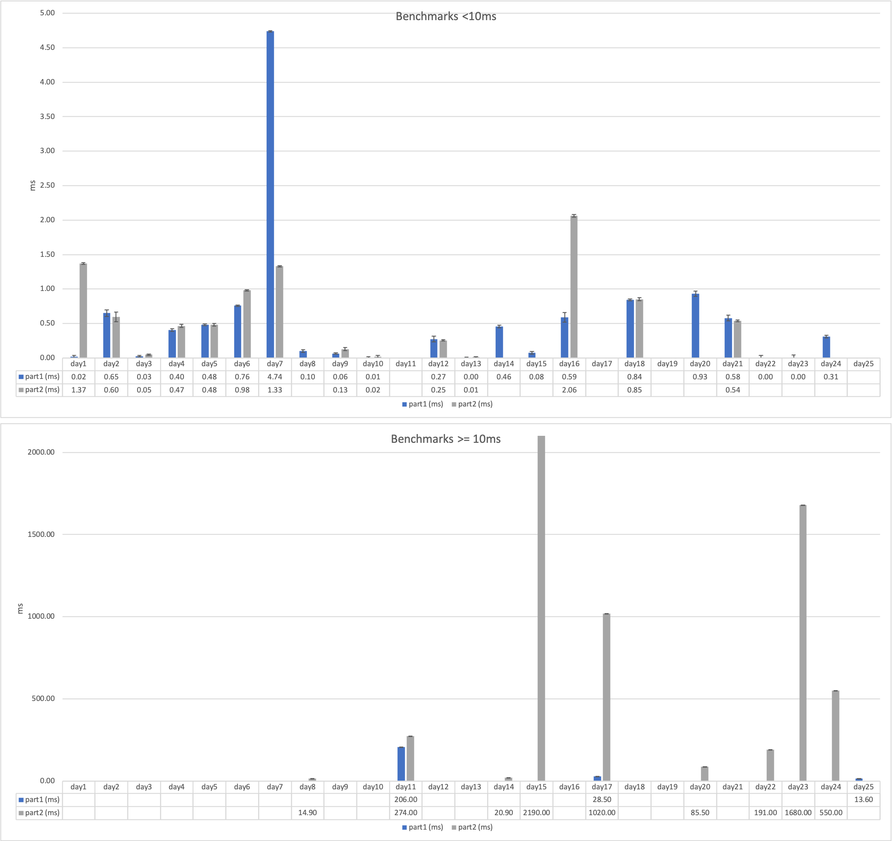
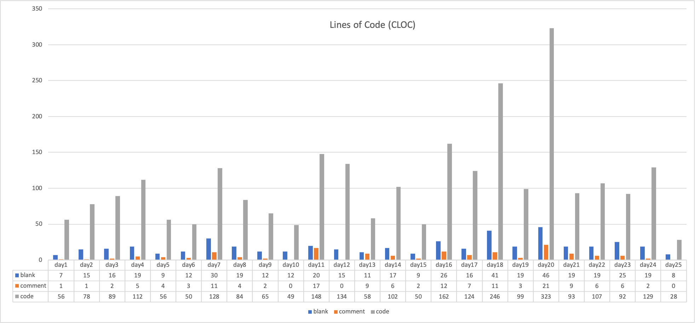

# adventofcode

- [2019](https://adventofcode.com/2019/)
- [2020](https://adventofcode.com/2020/)

# 2020

Day | Part 1 | Part 2
--- | --- | ---
[Day 1: Report Repair](https://adventofcode.com/2020/day/1) | [Go](https://github.com/yulrizka/adventofcode/blob/master/2020/go/day1/day1.go) (17.9µs ± 2%) | [Go](https://github.com/yulrizka/adventofcode/blob/master/2020/go/day1/day1.go) (1.37ms ± 1%) |
[Day 2: Password Philosophy](https://adventofcode.com/2020/day/2) | [Go](https://github.com/yulrizka/adventofcode/blob/master/2020/go/day2/day2.go) (650µs ± 5%) | [Go](https://github.com/yulrizka/adventofcode/blob/master/2020/go/day2/day2.go) (597µs ± 7%) |
[Day 3: Toboggan Trajectory](https://adventofcode.com/2020/day/3) | [Go](https://github.com/yulrizka/adventofcode/blob/master/2020/go/day3/day3.go) (26.0µs ± 1%) | [Go](https://github.com/yulrizka/adventofcode/blob/master/2020/go/day3/day3.go) (47.3µs ± 1%) |
[Day 4: Passport Processing](https://adventofcode.com/2020/day/4) | [Go](https://github.com/yulrizka/adventofcode/blob/master/2020/go/day4/day4.go) (404µs ± 2%) | [Go](https://github.com/yulrizka/adventofcode/blob/master/2020/go/day4/day4.go) (465µs ± 2%) |
[Day 5: Binary Boarding](https://adventofcode.com/2020/day/5) | [Go](https://github.com/yulrizka/adventofcode/blob/master/2020/go/day5/day5.go) (481µs ± 1%) | [Go](https://github.com/yulrizka/adventofcode/blob/master/2020/go/day5/day5.go) (480µs ± 2%) |
[Day 6: Custom Customs](https://adventofcode.com/2020/day/6) | [Go](https://github.com/yulrizka/adventofcode/blob/master/2020/go/day6/day6.go) (759µs ± 1%) | [Go](https://github.com/yulrizka/adventofcode/blob/master/2020/go/day6/day6.go) (981µs ± 1%) |
[Day 7: Handy Haversacks](https://adventofcode.com/2020/day/7) | [Go](https://github.com/yulrizka/adventofcode/blob/master/2020/go/day7/day7.go) (4.74ms ± 1%) | [Go](https://github.com/yulrizka/adventofcode/blob/master/2020/go/day7/day7.go) (1.33ms ± 1%) |
[Day 8: Handheld Halting](https://adventofcode.com/2020/day/8) | [Go](https://github.com/yulrizka/adventofcode/blob/master/2020/go/day8/day8.go) (100µs ± 2%) | [Go](https://github.com/yulrizka/adventofcode/blob/master/2020/go/day8/day8.go) (14.9ms ± 1%) |
[Day 9: Encoding Error](https://adventofcode.com/2020/day/9) | [Go](https://github.com/yulrizka/adventofcode/blob/master/2020/go/day9/day9.go) (64.2µs ± 1%) | [Go](https://github.com/yulrizka/adventofcode/blob/master/2020/go/day9/day9.go) (128µs ± 2%) |
[Day 10: Adapter Array](https://adventofcode.com/2020/day/10) | [Go](https://github.com/yulrizka/adventofcode/blob/master/2020/go/day10/day10.go) (7.49µs ± 1%) | [Go](https://github.com/yulrizka/adventofcode/blob/master/2020/go/day10/day10.go) (16.9µs ± 2%) |
[Day 11: Seating System](https://adventofcode.com/2020/day/11) | [Go](https://github.com/yulrizka/adventofcode/blob/master/2020/go/day11/day11.go) (206ms ±19%) | [Go](https://github.com/yulrizka/adventofcode/blob/master/2020/go/day11/day11.go) (274ms ± 4%) |
[Day 12: Rain Risk](https://adventofcode.com/2020/day/12) | [Go](https://github.com/yulrizka/adventofcode/blob/master/2020/go/day12/day12.go) (274µs ± 4%) | [Go](https://github.com/yulrizka/adventofcode/blob/master/2020/go/day12/day12.go) (254µs ± 1%) |
[Day 13: Shuttle Search](https://adventofcode.com/2020/day/13) | [Go](https://github.com/yulrizka/adventofcode/blob/master/2020/go/day13/day13.go) (3.14µs ± 1%) | [Go](https://github.com/yulrizka/adventofcode/blob/master/2020/go/day13/day13.go) (8.77µs ± 1%) |
[Day 14: Docking Data](https://adventofcode.com/2020/day/14) | [Go](https://github.com/yulrizka/adventofcode/blob/master/2020/go/day14/day14.go) (455µs ± 2%) | [Go](https://github.com/yulrizka/adventofcode/blob/master/2020/go/day14/day14.go) (20.9ms ± 2%) |
[Day 15: Rambunctious Recitation](https://adventofcode.com/2020/day/15) | [Go](https://github.com/yulrizka/adventofcode/blob/master/2020/go/day15/day15.go) (76.0µs ± 2%) | [Go](https://github.com/yulrizka/adventofcode/blob/master/2020/go/day15/day15.go) (2.19s ±14%) |
[Day 16: Ticket Translation](https://adventofcode.com/2020/day/16) | [Go](https://github.com/yulrizka/adventofcode/blob/master/2020/go/day16/day16.go) (590µs ± 7%) | [Go](https://github.com/yulrizka/adventofcode/blob/master/2020/go/day16/day16.go) (2.06ms ± 2%) |
[Day 17: Conway Cubes](https://adventofcode.com/2020/day/17) | [Go](https://github.com/yulrizka/adventofcode/blob/master/2020/go/day17/day17.go) (28.5ms ± 2%) | [Go](https://github.com/yulrizka/adventofcode/blob/master/2020/go/day17/day17.go) (1.02s ± 3%) |
[Day 18: Operation Order](https://adventofcode.com/2020/day/18) | [Go](https://github.com/yulrizka/adventofcode/blob/master/2020/go/day18/day18.go) (843µs ± 1%) | [Go](https://github.com/yulrizka/adventofcode/blob/master/2020/go/day18/day18.go) (852µs ± 2%) |
[Day 19: Monster Messages](https://adventofcode.com/2020/day/19) | [Go](https://github.com/yulrizka/adventofcode/blob/master/2020/go/day19/day19.go) (9.51ms ± 1%) | [Go](https://github.com/yulrizka/adventofcode/blob/master/2020/go/day19/day19.go) (9.76ms ± 8%) |
[Day 20: Jurassic Jigsaw](https://adventofcode.com/2020/day/20) | [Go](https://github.com/yulrizka/adventofcode/blob/master/2020/go/day20/day20.go) (933µs ± 4%) | [Go](https://github.com/yulrizka/adventofcode/blob/master/2020/go/day20/day20.go) (85.5ms ± 5%) |
[Day 21: Allergen Assessment](https://adventofcode.com/2020/day/21) | [Go](https://github.com/yulrizka/adventofcode/blob/master/2020/go/day21/day21.go) (578µs ± 4%) | [Go](https://github.com/yulrizka/adventofcode/blob/master/2020/go/day21/day21.go) (538µs ± 1%) |
[Day 22: Crab Combat](https://adventofcode.com/2020/day/22) | [Go](https://github.com/yulrizka/adventofcode/blob/master/2020/go/day22/day22.go) (3.98µs ± 3%) | [Go](https://github.com/yulrizka/adventofcode/blob/master/2020/go/day22/day22.go) (191ms ± 1%) |
[Day 23: Crab Cups](https://adventofcode.com/2020/day/23) | [Go](https://github.com/yulrizka/adventofcode/blob/master/2020/go/day23/day23.go) (3.94µs ± 4%) | [Go](https://github.com/yulrizka/adventofcode/blob/master/2020/go/day23/day23.go) (1.68s ± 6%) |
[Day 24: Lobby Layout](https://adventofcode.com/2020/day/24) | [Go](https://github.com/yulrizka/adventofcode/blob/master/2020/go/day24/day24.go) (311µs ± 2%) | [Go](https://github.com/yulrizka/adventofcode/blob/master/2020/go/day24/day24.go) (550ms ± 3%) |
[Day 25: Combo Breaker](https://adventofcode.com/2020/day/25) | [Go](https://github.com/yulrizka/adventofcode/blob/master/2020/go/day25/day25.go) (13.6ms ± 2%) | - |

Note: 
Benchmarked on Macbook Pro 15" 2019 2.4 GHz 8-Core Intel Core i9, 32 GB 2400 MHz DDR4 running Catalina (10.15.6)

